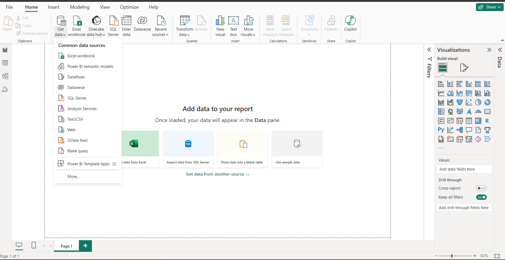
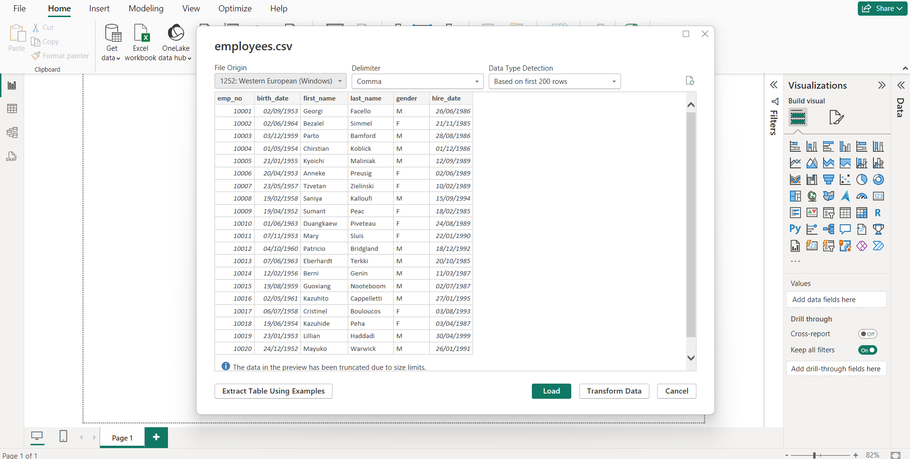
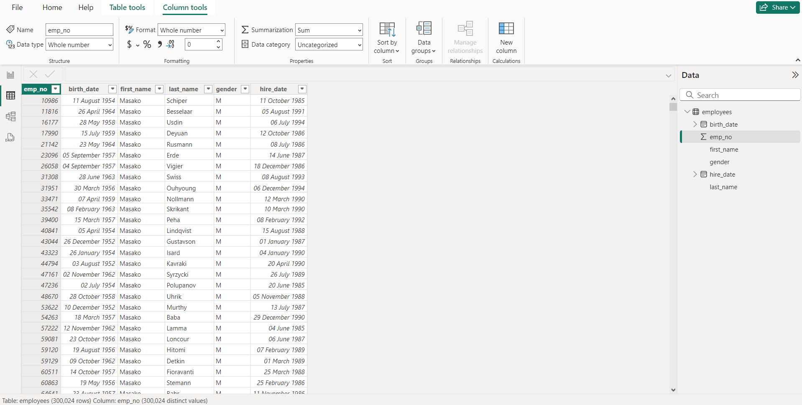
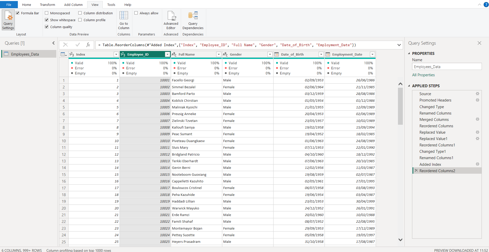
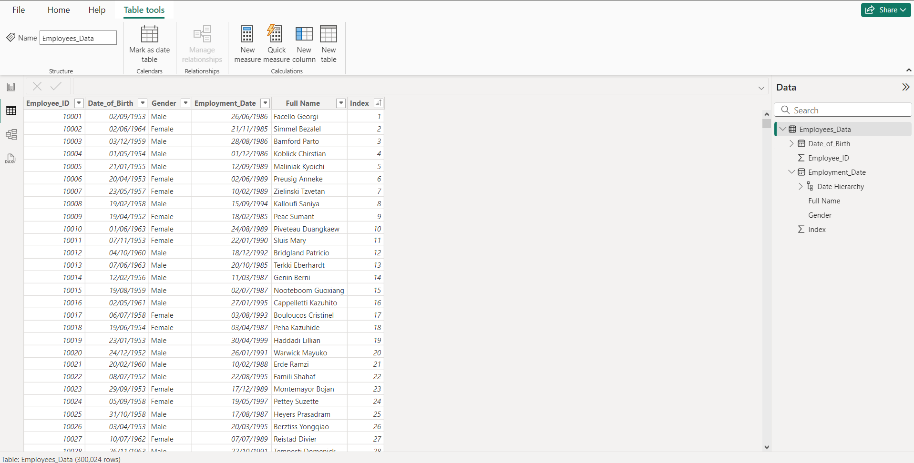
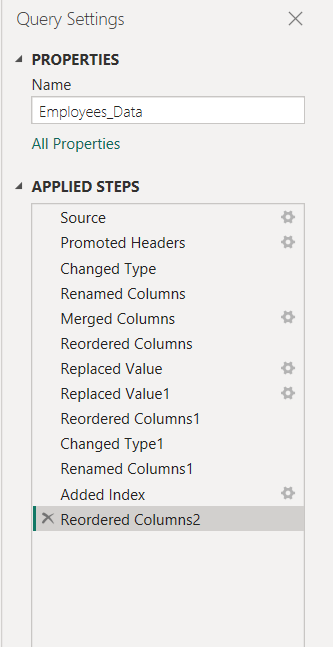

# Cleaning_Dataset_on_PowerBi

## INTRODUCTION
Data cleaning, also known as data cleansing or data scrubbing, is the process of identifying and correcting or removing errors, inconsistencies, and inaccuracies in a dataset. 
It involves transforming raw data into a clean and reliable format for analysis. 

## TASK 
1. Import CSV DATASET ‘employees’ into  Power BI Desktop using the csv file option
2. Clean data and get it ready for analysis using Power Query
3. Export back to PowerBI Cleaned

## EXECUTION
Here is a Correllation shewing steps and stages of my cleaning process
Fig 1. Shows the options used to perform a CSV import, featuring varieties of other options.
A preview of the "employee"data set is also shown here. 

| Fig 1. a                         | Fig 1. b                         |
| -------------------------------- | -------------------------------- |
|      |      |

Fig 2 shows the Loaded File "Employee" after it is being loaded into PowerBI

Fig 2. 

Fig 3. a shows the cleaned data with zero errors on the power querry editor, and Fig 3. b shows the dataset after being transfered to powerbi for further analysis.

| Fig 3. a                         | Fig 3. b                         |
| -------------------------------- | -------------------------------- |
|      |      |

Fig 4 shows the cleaning steps carried out to achieve a dataset free of dirt and issues.  

Fig 4.

 

---

Curated By [**Oshisanya Tokunbo**](https://x.com/Stunner_Guy)

